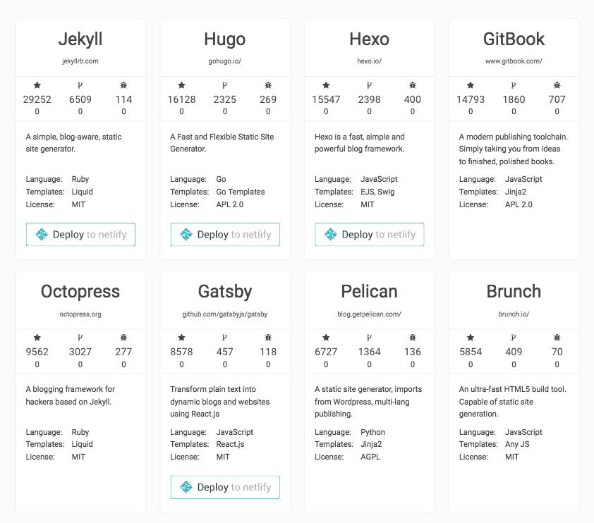

# MdRest 你所有关于博客的美好想象都在这里


从Markdown建站，几乎成了整个技术圈博客标配，但是Markdown的技术存在很多限制，搜索下目前Markdown博客引擎你会发现，所有的博客引擎定制化不是很高，并且目前很多很流行的博客引擎都不太完善。目前流行的Markdown引擎如下，奔着“免费的东西永远不会太好用”的原则，这些东西缺点显而易见。



对于一个技术流而言，这些博客可拓展性太差，对于一个非技术流而言，操作太复杂。一直想写一个restful风格的Markdown引擎，一个偶然的机会，工作中需要改版开发者中心的文档系统，于是一个Restful风格的Markdown引擎就应运而生了，耗时：5天。这比我想象的时间少了很多，于是就将其作为一个库进行开源。

先上几张图，说明Markown最终效果，当然，如果你是在我的博客中阅读这篇文章的话，博客本身就是最好的效果展示。


## 特性

### 1. 自由的目录结构和文章内容

自由的目录结构，你的博客目录可以是这个样子，所有的目录安排，图片资源摆放，完全可以按照你自己的喜好和规则，无需按照特定的约束进行。markdown rest引擎会将所有图片资源转换为以根目录为主目录绝对路径。也意味着，如果你的文章在git中浏览是正常的，那在博客中也会是正常的，无需对文章做转换。
```
    # Hello world
    This is content
    
    
    
    
```

### 2. 智能的文档属性

如果你用过其他的博客引擎，可能会要求你的博客是下面这个样子的。

```
    ---
    title: Hello world
    author: leenanxi
    catalog: blog
    tags: [tag1, tag2]
    date: 2016-12-29
    draft: true
    ---
    # Hello world
    This is content
```

Mdrest对Markdown的格式没有要求，是的，没有要求，你的文章可以是下面这个样子。文章的标题，创建日期，catalog 都可以自动生成。标题生成的的优先级是：yaml -> 第一个# -> 文件名。 草稿文章标题可以是 _filename.md。

```
    # Hello world
    This is content
```
### 3. 自由的JSON结构

MdRest支持任何格式的Yaml标签，它会将您的Ymal标签转换为JSON，例如您的文章可以是下面这个样子的。
```
    ---
    video: /videos/hello_word.mp4
    medias: [video1.mp4, video2.mp4,pic1.jpg]
    other1: 
  			name: "name"
  			x1: [3, 4]
    ---
    # Hello world
    This is content
```
### 4. 拓展Markdown渲染 （模仿简书）
 我们的博客中图片难免需要插入图片标注，之前很多人的做法是给图片下面添加一个段落或块引用来进行，其实Markdown原生支持  这样的形式，mdrest会自动将title作为题注，进行html渲染，当然，您可以在markdown中使用html进行更复杂的操作，但是那样就不太完美了。

```
# Hello world

```


## 简单

### JSON格式，高度技术流自定义


### 一键按照，无需任何环境，引擎。


